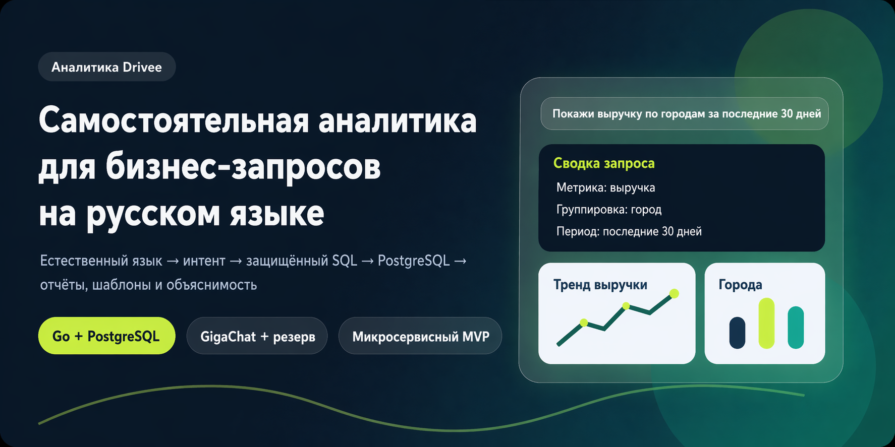
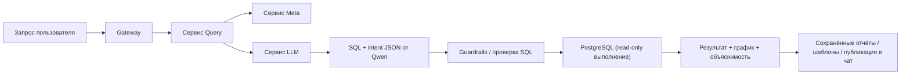

<div align="center">
  
</div>

<div align="center">

# Рабочее пространство Drivee Analytics

### Самостоятельная аналитика для бизнес-запросов на русском языке

<p>
  <a href="https://golang.org/"></a>
  <a href="https://www.postgresql.org/"></a>
  
  
  
</p>

<p>
  Микросервисный MVP для внутренней аналитики, где пользователь формулирует вопрос обычным русским языком, а система
  отправляет его в Qwen, получает SQL, прогоняет SQL через guardrails, выполняет запрос в PostgreSQL и
  возвращает результат с объяснимостью, визуализацией, архивом отчётов и шаблонами.
</p>

</div>

---

## Обзор

Drivee Analytics Workspace показывает зрелый инженерный подход к аналитическому продукту:

- Qwen через Cerebras Cloud преобразует русский запрос сразу в SQL и краткий intent для интерфейса.
- Итоговый SQL не выполняется напрямую: перед БД он обязательно проходит Go guardrails.
- Выполнение запросов идёт под read-only пользователем базы данных.
- В системе есть не только аналитика, но и полноценный пользовательский контур:
  отчёты, шаблоны, роли, подтверждение пользователей, чат и совместная работа.

### Основной поток

```text
Запрос пользователя -> Qwen SQL -> Guardrails -> PostgreSQL read-only -> Результат -> Отчёт / Шаблон / Публикация
```

## Содержание

- [Снимок продукта](#снимок-продукта)
- [Визуальная архитектура](#визуальная-архитектура)
- [Почему проект выглядит серьёзно](#почему-проект-выглядит-серьёзно)
- [Возможности](#возможности)
- [Технологический стек](#технологический-стек)
- [Структура репозитория](#структура-репозитория)
- [Быстрый старт](#быстрый-старт)
- [Ручная локальная настройка](#ручная-локальная-настройка)
- [Конфигурация](#конфигурация)
- [Как это работает](#как-это-работает)
- [Основные экраны](#основные-экраны)
- [API и порты](#api-и-порты)
- [Безопасность и guardrails](#безопасность-и-guardrails)
- [Тестирование](#тестирование)
- [Примеры запросов](#примеры-запросов)
- [Документация для разработчиков](#документация-для-разработчиков)

## Снимок продукта

<table>
  <tr>
    <td width="33%">
      <strong>Аналитика на естественном языке</strong><br />
      Бизнес-пользователь задаёт вопрос на русском языке без SQL.
    </td>
    <td width="33%">
      <strong>Qwen + guardrails</strong><br />
      LLM генерирует SQL, а Query-сервис пропускает его через whitelist и read-only выполнение.
    </td>
    <td width="33%">
      <strong>Рабочий операционный контур</strong><br />
      Результат можно сохранить, экспортировать, превратить в шаблон и обсудить в чате.
    </td>
  </tr>
</table>

### Карта сервисов

| Сервис | Порт по умолчанию | Ответственность |
|---|---:|---|
| `gateway` | `8080` | Раздача frontend и единая точка входа для API |
| `query` | `8081` | Оркестрация `meta` + `llm` + guardrails + read-only исполнение |
| `llm` | `8082` | Вызов Qwen через Cerebras Cloud: русский текст -> SQL + intent JSON |
| `reports` | `8083` | Архив отчётов, шаблоны, расписание, экспорт |
| `meta` | `8084` | Semantic layer, glossary, термины, примеры вопросов |
| `auth` | `8085` | Пользователи, сессии, подтверждение, роли, отделы |
| `chat` | `8086` | Комнаты, сообщения, вложения, SSE-события |

## Возможности

### Аналитика

- Аналитические запросы на русском языке.
- Генерация SQL через Qwen.
- Объяснимость: метрика, группировка, период, фильтры, confidence.
- Табличный результат и визуализация.
- Поддержка временных окон и сравнений периодов.

### Отчёты

- Сохранение отчётов.
- Повторное открытие отчётов.
- PDF-экспорт.
- Шаблоны отчётов.
- Расписание повторного запуска шаблонов.

### Совместная работа и доступы

- Авторизация и сессии.
- Root / manager / user.
- Подтверждение новых пользователей.
- Привязка к отделам и доступ по отделам.
- Внутренний чат с публикацией отчётов и шаблонов.

## Технологический стек

| Слой | Технологии |
|---|---|
| Backend | `Go 1.26`, `net/http` |
| Database | `PostgreSQL 16` |
| DB driver | `pgx/v5`, `pgxpool` |
| Экспорт | `gofpdf` |
| Frontend | `HTML`, `CSS`, `Vanilla JavaScript` |
| Локальный orchestration | `PowerShell` |
| LLM | `Qwen 3 235B Instruct` через `Cerebras Cloud` |

## Структура репозитория

```text
cmd/
  apply-migration/   CLI для миграций
  auth/              аутентификация и пользователи
  chat/              чат и live-события
  gateway/           статический frontend + reverse proxy
  llm/               Qwen/Cerebras интеграция и генерация SQL
  meta/              API semantic layer
  query/             NL -> intent -> SQL -> result
  reports/           отчёты, шаблоны, scheduler, экспорт

db/
  schema.sql         полная схема БД

docs/
  architecture.md
  implementation-plan.md
  assets/            графика и схемы для README

internal/shared/
  общие контракты, guardrails, auth/http/env/pg helpers

scripts/
  run-local.ps1      рекомендуемый локальный стартовый скрипт

web/
  страницы приложения и frontend-скрипты
```

## Быстрый старт

### Вариант A. Docker для PostgreSQL + локальные Go-сервисы

1. Установите:
   - `Go 1.26+`
   - `Docker`
   - `Docker Compose`
2. Поднимите PostgreSQL:

```powershell
docker compose up -d
```

3. Создайте локальную конфигурацию и вставьте ключ Cerebras:

```powershell
Copy-Item .env.example .env
# затем заполните CEREBRAS_API_KEY в .env
```

4. Запустите все сервисы:

```powershell
powershell -ExecutionPolicy Bypass -File .\scripts\run-local.ps1
```

5. Откройте приложение:

```text
http://localhost:8080
```

### Рекомендуемые флаги запуска

```powershell
powershell -ExecutionPolicy Bypass -File .\scripts\run-local.ps1 -StopExisting
```

Останавливает предыдущие процессы проекта, если стандартные порты уже заняты.

```powershell
powershell -ExecutionPolicy Bypass -File .\scripts\run-local.ps1 -AllowPortFallback
```

Разрешает запуск на свободных портах, если стандартные заняты.

<details>
  <summary><strong>Что делает стартовый скрипт</strong></summary>

- читает `.env`;
- подставляет дефолтные переменные;
- проверяет конфликты портов;
- собирает сервисы в `.bin`;
- поднимает каждый сервис в отдельном окне PowerShell;
- печатает итоговый `Gateway URL`.

</details>

## Ручная локальная настройка

Если PostgreSQL уже установлен локально, проект можно поднять вручную.

### 1. Создать базу данных

Создайте базу данных `drivee_analytics`.

### 2. Применить схему и сиды

```powershell
psql -U postgres -d drivee_analytics -f .\db\schema.sql
psql -U postgres -d drivee_analytics -f .\db\seed.sql
```

### 3. Подготовить окружение

```powershell
Copy-Item .env.example .env
```

Проверьте как минимум:

- `PG_DSN`
- `PG_READONLY_DSN`
- `ROOT_EMAIL`
- `ROOT_PASSWORD`
- `LLM_PROVIDER=qwen`
- `CEREBRAS_API_KEY`
- `LLM_SETTINGS_FILE=config/qwen_sql_settings.md`

### 4. Запустить сервисы

```powershell
go run ./cmd/meta
go run ./cmd/llm
go run ./cmd/query
go run ./cmd/reports
go run ./cmd/auth
go run ./cmd/chat
go run ./cmd/gateway
```

## Конфигурация

### База данных

| Переменная | Описание |
|---|---|
| `PG_DSN` | Основной DSN для сервисов, которым нужна запись |
| `PG_READONLY_DSN` | DSN read-only пользователя для аналитических запросов |

### Порты

| Переменная | По умолчанию |
|---|---:|
| `GATEWAY_PORT` | `8080` |
| `QUERY_PORT` | `8081` |
| `LLM_PORT` | `8082` |
| `REPORTS_PORT` | `8083` |
| `META_PORT` | `8084` |
| `AUTH_PORT` | `8085` |
| `CHAT_PORT` | `8086` |

### Внутренние URL сервисов

| Переменная | По умолчанию |
|---|---|
| `QUERY_SERVICE_URL` | `http://localhost:8081` |
| `LLM_SERVICE_URL` | `http://localhost:8082` |
| `REPORTS_SERVICE_URL` | `http://localhost:8083` |
| `META_SERVICE_URL` | `http://localhost:8084` |
| `AUTH_SERVICE_URL` | `http://localhost:8085` |
| `CHAT_SERVICE_URL` | `http://localhost:8086` |

### Identity и bootstrapping

| Переменная | Описание |
|---|---|
| `ROOT_EMAIL` | Email bootstrap root-пользователя |
| `ROOT_PASSWORD` | Пароль bootstrap root-пользователя |
| `ROOT_FULL_NAME` | Имя root-пользователя |
| `ROOT_DEPARTMENT` | Отдел root-пользователя |
| `PASSWORD_SALT` | Соль для парольной логики |

### LLM / Qwen через Cerebras

| Переменная | Описание |
|---|---|
| `LLM_PROVIDER` | Только `qwen` |
| `LLM_SETTINGS_FILE` | Файл инструкций нейросети, по умолчанию `config/qwen_sql_settings.md` |
| `CEREBRAS_API_KEY` | API-ключ из `https://cloud.cerebras.ai/` |
| `CEREBRAS_MODEL` | `qwen-3-235b-a22b-instruct-2507` |
| `CEREBRAS_CHAT_URL` | endpoint Chat Completions |
| `CEREBRAS_TIMEOUT_SECONDS` | Таймаут вызова модели |
| `CEREBRAS_TEMPERATURE` | Температура генерации, рекомендуется `0` для SQL |
| `CEREBRAS_MAX_COMPLETION_TOKENS` | Максимум токенов ответа |

## Как это работает

### Жизненный цикл запроса



### Базовый принцип

> LLM не выполняет SQL и не подключается к БД.  
> LLM предлагает интент.  
> Backend владеет SQL.

### Доступные страницы

| Страница | Назначение |
|---|---|
| `/` | Главная аналитическая панель |
| `/glossary.html` | Словарь и semantic layer |
| `/templates.html` | Шаблоны отчётов |
| `/reports.html` | Архив отчётов |
| `/admin.html` | Управление пользователями и доступами |
| `/chat.html` | Внутренние чаты и обмен артефактами |

## API и порты

### Gateway и UI

| URL | Назначение |
|---|---|
| `http://localhost:8080/` | Главное рабочее пространство |
| `http://localhost:8080/health` | Проверка здоровья gateway |
| `http://localhost:8080/glossary.html` | Словарь |
| `http://localhost:8080/templates.html` | Шаблоны |
| `http://localhost:8080/reports.html` | Архив отчётов |
| `http://localhost:8080/admin.html` | Админ-панель |
| `http://localhost:8080/chat.html` | Чат |

### Внутренние health endpoints

- `http://localhost:8081/health`
- `http://localhost:8082/health`
- `http://localhost:8083/health`
- `http://localhost:8084/health`
- `http://localhost:8085/health`
- `http://localhost:8086/health`

## Безопасность и guardrails

<table>
  <tr>
    <td width="50%">
      <strong>Граница LLM</strong><br />
      Модель возвращает <code>intent</code>, а не финальный SQL.
    </td>
    <td width="50%">
      <strong>Граница выполнения</strong><br />
      Выполнение идёт через отдельный read-only DSN.
    </td>
  </tr>
  <tr>
    <td width="50%">
      <strong>Разрешённый список полей</strong><br />
      Метрики, группировки и фильтры разрешены только из контролируемого слоя.
    </td>
    <td width="50%">
      <strong>Аудитируемость</strong><br />
      Запросы и ошибки журналируются в <code>app.query_logs</code>.
    </td>
  </tr>
</table>

## Тестирование

Запуск всех тестов:

```powershell
go test ./...
```

Покрытые зоны проекта:

- `cmd/llm`
- `cmd/query`
- `cmd/reports`
- `internal/shared`


## Документация для разработчиков

Для команды разработки подготовлен отдельный подробный документ:

- [ForDeveloper.md](./ForDeveloper.md)

Он покрывает:

- назначение каждого сервиса;
- карту ключевых файлов;
- устройство backend и frontend;
- структуру БД;
- правила расширения метрик, фильтров и API;
- инженерные ограничения и рекомендации по развитию.

---

<div align="center">
  <strong>Рабочее пространство Drivee Analytics</strong><br />
  Безопасная аналитическая оркестрация для бизнес-вопросов на русском языке.
</div>
